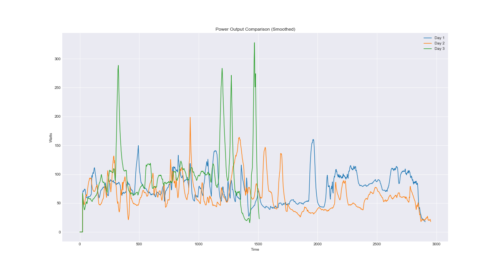
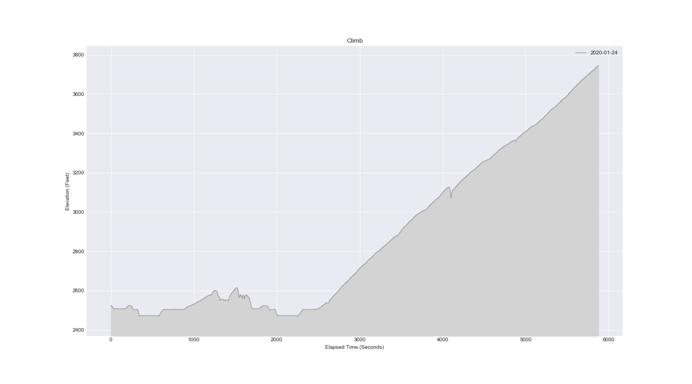

## Messing around with FIT Files
Just me messing around with Garmin FIT files downloaded from Zwift.

#### Setup
1. Create & activate a virtual environment
2. Install the requirements using pip
3. Install this project in your environment: python setup.py install
4. Start Jupyter Lab and go to the notebooks directory

#### Examples
##### Smoothed Power Output

##### Elevation Changes
